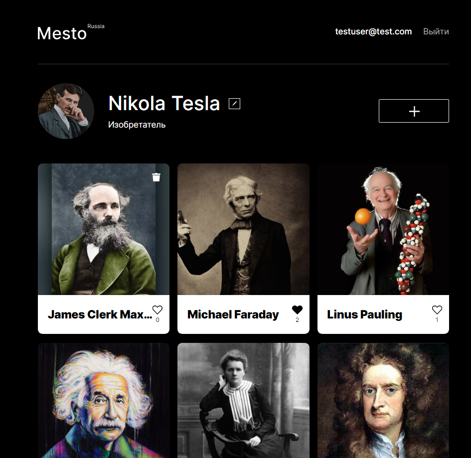

[](https://github.com/yandex-praktikum/react-mesto-api-full-gha/actions/workflows/tests.yml)

# Mesto

Cервис Mesto: интерактивная страница, куда можно добавлять фотографии, удалять их и ставить лайки.

Состоит из frontend и backend частей.

## Demo

Frontend:

[mesto-demo.surge.sh](https://mesto-demo.surge.sh/)

Email: testuser@test.com  
Пароль: 11111111

## Functional

Frontend:

- регистрация и авторизация пользователей
- реализовано добавление/удаление лайка
- добавление и удаление собственной карточки
- редактирование профиля и аватара
- модальные окна открываются при нажатии на соответствующий элемент интерфейса

Backend:

- при запуске приложение подключается к серверу mongo
- в приложении описаны схемы пользователя, карточки. Все поля схем пользователя и карточки валидируются
- во всех контроллерах предусмотрена гарантированная отправка сообщения об ошибке, сообщение об ошибке соответствует её типу, нет обработки невозможных ошибок
- приложение корректно обрабатывает запросы по роутам, все роуты, кроме /signin и /signup , защищены авторизацией
- централизованный обработчик ошибок в единой middleware
- запросы и ответы записываются в файл request.log, все ошибки записываются в файл error.log ;
- поддержка CORS запросов

## Tech Stack

<span>
  
  
  
  
  
  <a href=""></a>
  <a href=""></a>
  <a href=""></a>
  
</span>

## Screenshots



## Run Locally

Clone the project

```bash
  git clone https://github.com/simfart/react-mesto-api-full-gha.git
```

Go to the project directory backend

```bash
  cd backend
```

Install dependencies

```bash
  npm install
```

Start the server (hot reload)

```bash
  npm run dev
```

Go to the project directory frontend

```bash
  cd frontend
```

Install dependencies

```bash
  npm install
```

Start the server (localhost:3000)

```bash
  npm start
```

## Author

e-mail: artzbox7@gmail.com

Telegram: @artzina
